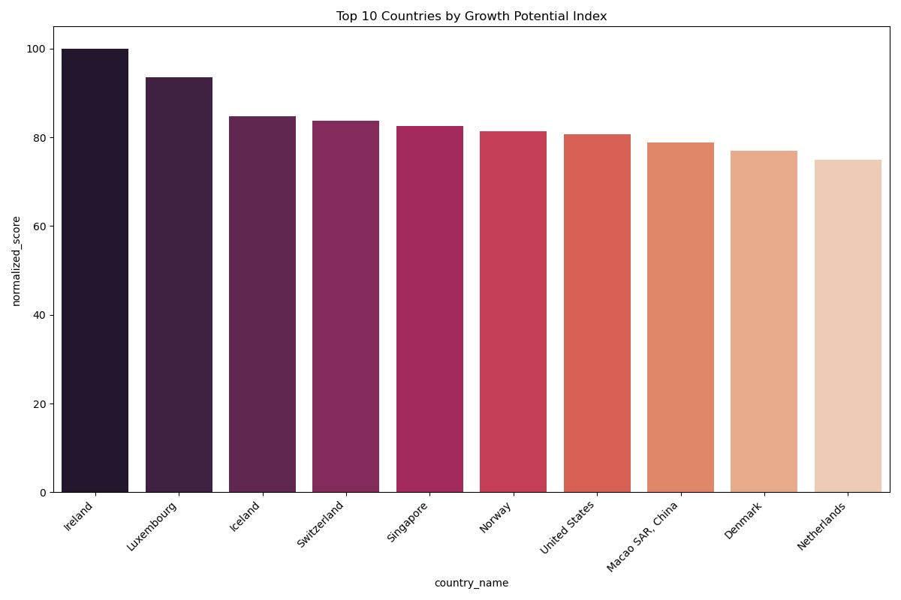
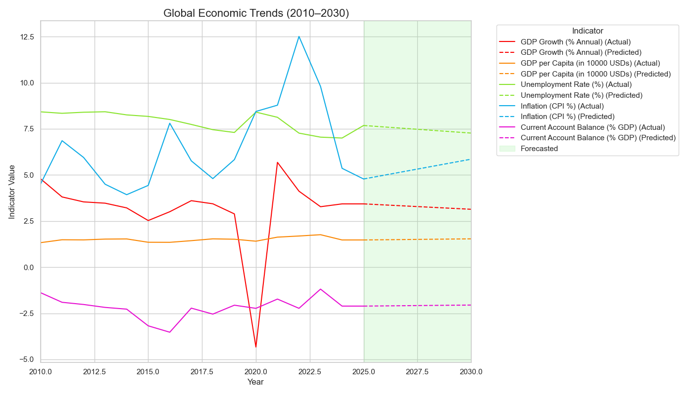

# World Bank Growth Potential Index

This is a real-world data analysis and visualization project built using `pandas`, `NumPy`, `Matplotlib`, `Seaborn`, and `SciPy`. It uses publicly available World Bank economic data to develop a custom index that ranks countries based on their potential for economic growth in the near future, with projections up to 2030.

---

## Features/Points of Focus

- Extract and clean multi-year World Bank economic data from CSV
- Fill missing values using median (grouped by country)
- Manual slope calculation using `np.polyfit()` to estimate long-term economic trends
- Apply min-max normalization with outlier clipping
- Assign custom weights to indicators to compute a growth score
- Project economic indicators to 2030 using slope-based extrapolation
- Generate a custom Growth Potential Index scaled to 0–100
- Visualize results using:
  - Boxplots (raw and weighted indicator distributions) -> 
  - Bar chart (top 10 countries by growth potential)
  - Heatmap (indicator correlations)
  - Line plot (global economic indicator trends with forecast region shaded)
- Save key statistics, ranked country list, and forecasts to CSV
- Log and summarize computed values

---

## Indicators and Weights Used

| Indicator                          | Weight | Description                             |
|-----------------------------------|--------|------------------------------------------|
| GDP Growth (% Annual)             | +0.15  | Measures actual growth rate              |
| GDP per Capita (Current USD)      | +0.25  | Reflects wealth (USD-based, absolute)    |
| Unemployment Rate (%)             | -0.25  | Penalized (lower is better)              |
| Inflation (CPI %)                 | -0.20  | Penalized (stable prices preferred)      |
| Current Account Balance (% GDP)   | +0.15  | Captures external trade strength         |

---

## Sample Work

###  Top 10 Countries by Growth Potential Score



###  Global Economic Trends (2010 - 2030)



---

## Files

- `wb_analysis.py` — Main Python script
- `world_bank_data_2025.csv` — Input data (World Bank snapshot)
- `world_bank_cleaned.csv` — Cleaned version of the dataset
- `world_bank_slopes.csv` — Slopes of economic indicators
- `world_bank_normalized.csv` — Min-max normalized version
- `world_bank_2030_prediction.csv` — Projected 2030 values
- `growth_potential_index.csv` — Final ranked index with scores
- `global_predicted_trend_2025_2030.csv` — Global average trends
- `summary_stats.csv` — Summary stats for projected indicators
- `top_10_countries_bar_chart.png` — Top 10 visualization
- `boxplot_raw_indicators_stacked.png` — Raw data distributions
- `boxplot_weighted_indicators_stacked.png` — Weighted data distributions
- `indicator_combined_correlation_heatmap.png` — Correlation heatmap

---

## Requirements

- Python 3.9+
- Libraries:
  - pandas
  - numpy
  - matplotlib
  - seaborn
  - scipy

Install requirements (if needed):

```bash
pip install pandas numpy matplotlib seaborn scipy
